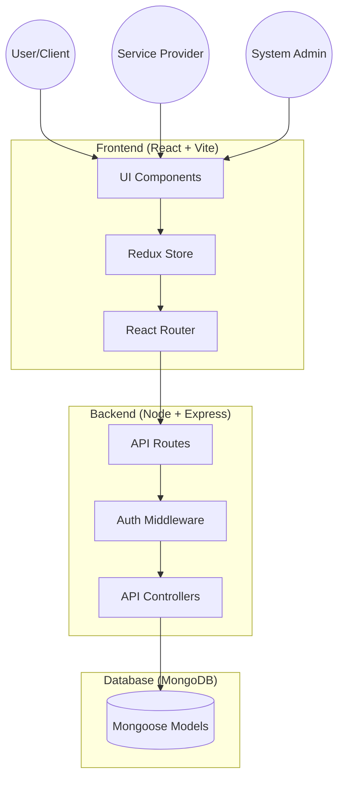
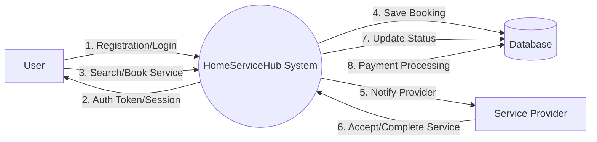
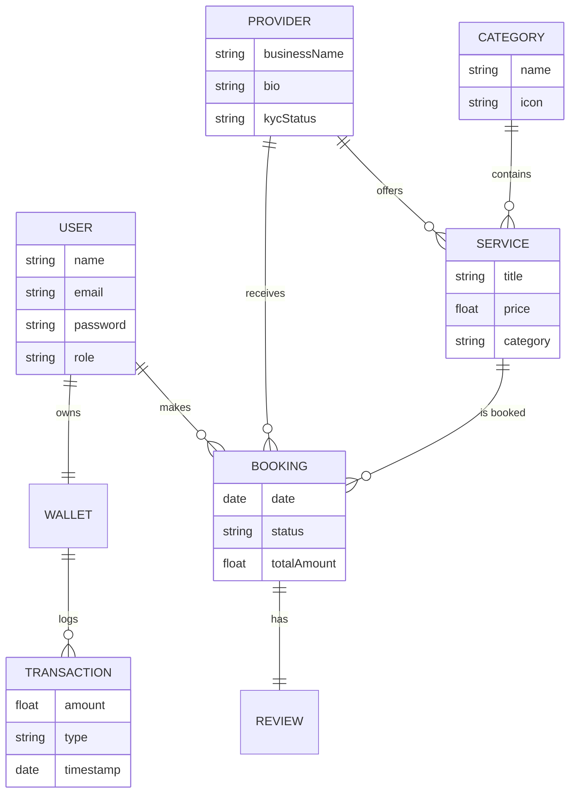
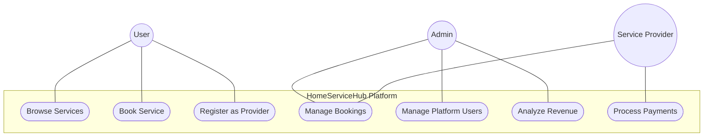
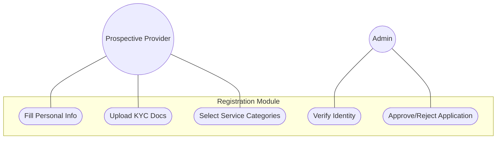
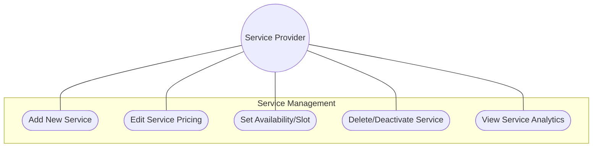
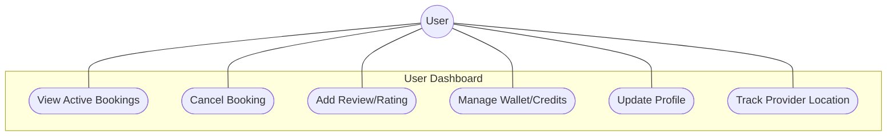
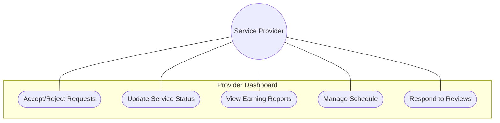

# HomeServiceHub: System Design & Documentation

This document provides a comprehensive overview of the **HomeServiceHub** architecture, data flow, entity relationships, and functional use cases.

---

## 1. Architectural Design
The system follows a **MERN Stack** (MongoDB, Express, React, Node.js) architecture, leveraging a decoupled client-server model.

### Architecture Overview
- **Frontend**: React.js with Vite for high-performance builds. State management is handled via Redux Toolkit. Styling is implemented using Tailwind CSS for a responsive, utility-first design.
- **Backend**: Node.js and Express.js provide a RESTful API. JWT (JSON Web Tokens) are used for stateless authentication.
- **Database**: MongoDB (NoSQL) stores document-based data for flexible schemas (Services, Providers, Users).
- **Security**: Password hashing with Bcrypt, CORS for cross-origin requests, and middleware-level authorization.

---

## 2. Data Flow Diagram (DFD - Level 1)
The Data Flow Diagram illustrates how information moves through the HomeServiceHub system.

---

## 3. ER Diagram (Entity Relationship)
The ER Diagram defines the relationship between core entities like Users, Providers, Services, and Bookings.

---

## 4. Use Case Diagram of SAP (Service Application Platform)
This diagram covers the high-level interactions of all actors with the main platform.

---

## 5. UI/UX Design of SAP
The UI/UX design is centered around **accessibility**, **trust**, and **efficiency**.

### Design Principles
- **Clarity**: High-contrast typography and clear call-to-action (CTA) buttons.
- **Consistency**: Unified color palette (Deep Blue, Slate Gray, and Mint Green for success states).
- **Responsiveness**: Mobile-first approach ensuring 100% functionality on handheld devices.

### Key Screens
1. **Landing Page**: Search bar for services, top-rated categories, and "How it works" section.
2. **Service Listing**: Grid view with filters for price, rating, and location.
3. **Booking Flow**: A 3-step wizard (Select Date/Time -> Enter Address -> Payment).
4. **Interactive Dashboards**: Data visualization using charts for earnings (Providers) and booking history (Users).

---

## 6. Use Case Diagram: Provider Registration
Specific flow for onboarding new service providers.

---

## 7. Use Case Diagram: Service Management Module
Focuses on how providers manage their offerings.

---

## 8. Use Case Diagram: User Dashboard
Interactions available to the customer role.

---

## 9. Use Case Diagram: Provider Dashboard
Interactions available to the service provider role.

